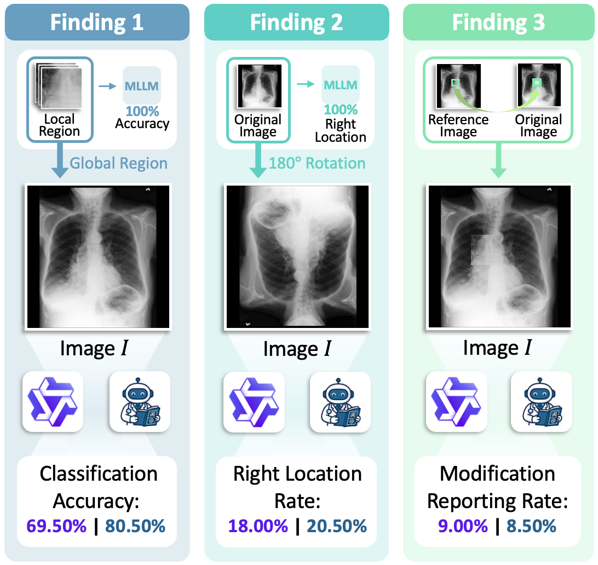
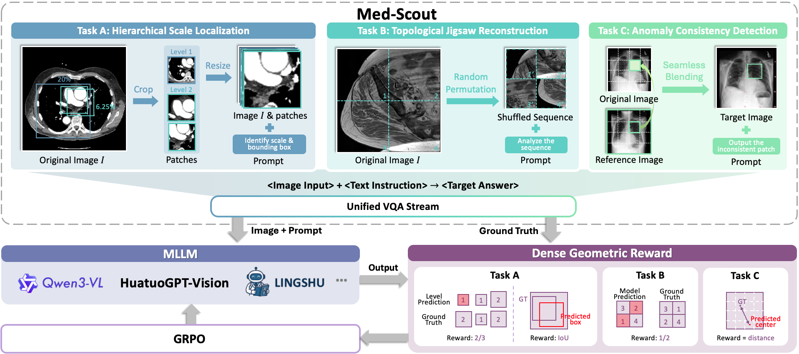
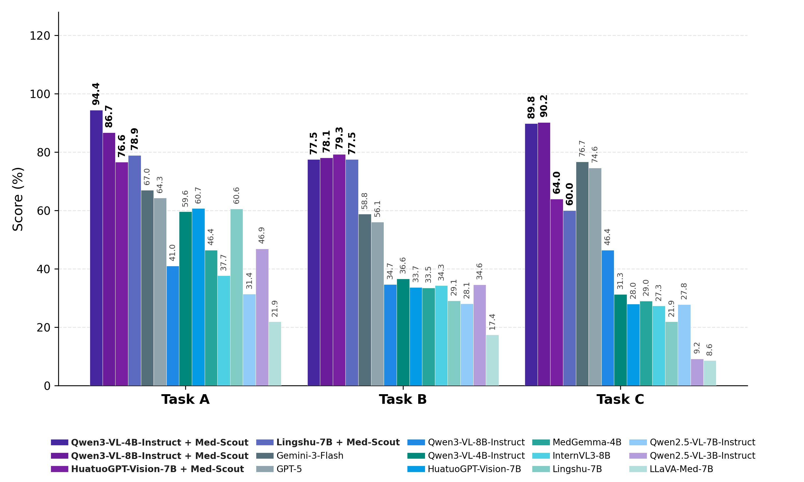
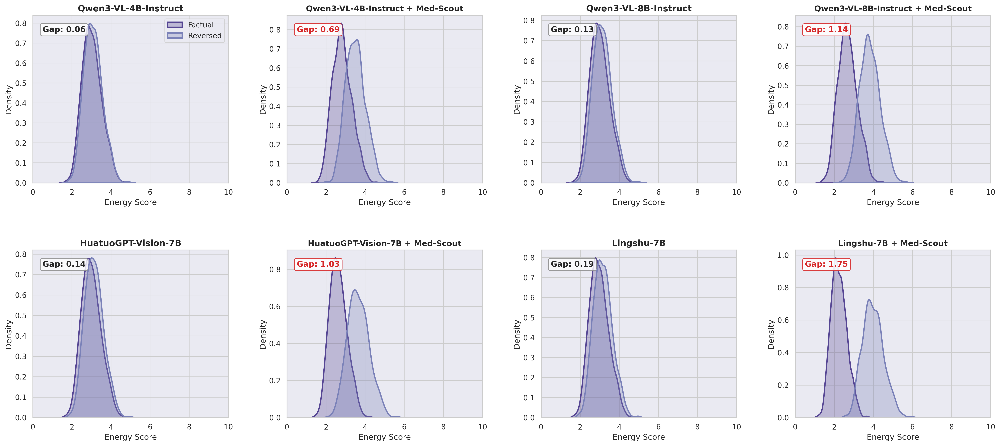

# 🏥 Med-Scout: Curing MLLMs' Geometric Blindness in Medical Perception via Geometry-Aware RL Post-Training
<div align="center">

<span class="author">
  Anglin Liu<sup>1</sup>,
  Ruichao Chen<sup>2</sup>,
  Yi Lu<sup>1</sup>,
  Hongxia Xu<sup>2</sup>,
  <a href="https://whatashot.github.io/">Jintai Chen</a><sup>1,3</sup>✉️
</span>

<br>

<span class="affiliations">
  <sup>1</sup>The Hong Kong University of Science and Technology (Guangzhou)<br>
  <sup>2</sup>Zhejiang University<br>
  <sup>3</sup>The Hong Kong University of Science and Technology
</span>

<br>

[](https://arxiv.org/abs/2601.23220)
[](https://c0216rc.github.io/Med-Scout/)
[](https://huggingface.co/datasets)
[](https://huggingface.co/models)

</div>

<div align="left">
  
<br>
🚧 Note: Model weights and Med-Scout-Bench are coming soon.

## 📖 Abstract

Despite recent Multimodal Large Language Models (MLLMs)' linguistic prowess in medical diagnosis, we find even state-of-the-art MLLMs suffer from a critical perceptual deficit: **geometric blindness** 🕶️. This failure to ground outputs in objective geometric constraints leads to plausible yet factually incorrect hallucinations, rooted in training paradigms that prioritize linguistic fluency over geometric fidelity. This paper introduces **Med-Scout**, a novel framework that “cures”💊 this blindness via Reinforcement Learning (RL) that leverages the intrinsic geometric logic latent within unlabeled medical images. Instead of relying on costly expert annotations, Med-Scout derives verifiable supervision signals through three strategic proxy tasks: Hierarchical Scale Localization, Topological Jigsaw Reconstruction, and Anomaly Consistency Detection. To rigorously quantify this deficit, we present **Med-Scout-Bench**, a new benchmark specifically designed to evaluate geometric perception. Extensive evaluations show that Med-Scout significantly mitigates geometric blindness, outperforming leading proprietary and open-source MLLMs by over **40%** on our benchmark. Furthermore, this enhanced geometric perception generalizes to broader medical understanding, achieving superior results on radiological and comprehensive medical VQA tasks.

---

## 🔬 Pilot Study: Unveiling Geometric Blindness

We conducted a pilot study on SOTA MLLMs (e.g., Qwen3-VL, Lingshu), revealing three critical deficits:

* 🔍 **Scale Blindness:** Models struggle to transfer recognition between local crops and global views (20% performance drop).
* 🧩 **Topology Blindness:** Models rely on rigid priors; failing to update spatial descriptions when images are rotated (80% failure rate).
* 🔄 **Anomaly Blindness:** Models are insensitive to structural "cut-paste" artifacts, overlooking artificial modifications in over 90% of cases.

<div align="center">
  
</div>

> *Figure 1: The pilot study revealing Inconsistency Between Scales (Left), Blindness to Relative Spatial Positions (Middle), and Insensitivity to Structural Anomalies (Right).*

---

## 🚀 Method: Med-Scout Framework

Med-Scout actively cures geometric blindness via **Geometry-Aware RL Post-Training**. We decompose medical perception into three intrinsic proxy tasks:

1.  📏 **Hierarchical Scale Localization ($\mathcal{T}_{scale}$):** Enforces awareness of anatomical details across varying zoom scales.
2.  🧩 **Topological Jigsaw Reconstruction ($\mathcal{T}_{topo}$):** Demands logical deduction of global anatomical layouts.
3.  🕵️ **Anomaly Consistency Detection ($\mathcal{T}_{anom}$):** Necessitates comparative scrutiny to identify pixel-level structural artifacts.

We optimize these tasks using **Group Relative Policy Optimization (GRPO)** with a specialized **Dense Geometric Reward (DGR)** mechanism to ensure stable convergence.

<div align="center">
  
</div>

> *Figure 2: Overview of the Med-Scout Framework. Unlabeled medical images are transformed into verifiable proxy tasks to align semantic generation with geometric reality.*

---

## 📊 Performance on Med-Scout-Bench

We introduce **Med-Scout-Bench**, a geometrically rigorous benchmark comprising 10,800 balanced samples across CT, MRI, and X-ray.

Med-Scout yields massive improvements across all backbones. For instance, the aligned **Qwen3-VL-8B-Instruct improves average accuracy from 39.7% to 83.6%**, significantly outperforming proprietary models like GPT-5 and Gemini-3-Flash.

<div align="center">
  
</div>

> *Figure 3: Performance comparison on Med-Scout-Bench showing substantial gains across various backbones.*

---

## 🏆 Generalization: 6 Medical Benchmarks

Med-Scout not only improves geometric perception but also generalizes to broader medical understanding.

The table below visualizes the performance shift. In our paper's heatmap, **darker purple** represents higher accuracy. Here, **Bold** numbers indicate the best performance, showing how Med-Scout consistently shifts models to the "high-performance (purple)" spectrum.

| Model | **Rad-VQA** | **VQA-RAD** | **SLAKE** | **PMC-VQA** | **OmniMedVQA** | **MedXpertQA** |
| :--- | :---: | :---: | :---: | :---: | :---: | :---: |
| **Qwen3-VL-8B-Instruct** | 41.6 | 63.2 | 69.6 | 43.9 | 42.9 | 30.4 |
| **+ Med-Scout** | **45.3** <small>(+3.7)</small> | **65.8** <small>(+2.6)</small> | **72.0** <small>(+2.4)</small> | **45.5** <small>(+1.6)</small> | **46.0** <small>(+3.1)</small> | **30.8** <small>(+0.4)</small> |
| | | | | | | |
| **HuatuoGPT-Vision-7B** | 48.8 | 67.0 | 67.8 | 53.0 | 75.0 | 22.4 |
| **+ Med-Scout** | **52.1** <small>(+3.3)</small> | **70.1** <small>(+3.1)</small> | **71.0** <small>(+3.2)</small> | **55.9** <small>(+2.9)</small> | **75.4** <small>(+0.4)</small> | **22.7** <small>(+0.3)</small> |
| | | | | | | |
| **Lingshu-7B** | 61.2 | 68.9 | 82.8 | 56.3 | 81.4 | 27.4 |
| **+ Med-Scout** | **64.0** <small>(+2.8)</small> | **71.0** <small>(+2.1)</small> | **83.0** <small>(+0.2)</small> | **57.4** <small>(+1.1)</small> | **81.9** <small>(+0.5)</small> | **28.0** <small>(+0.6)</small> |

> *Note: Performance gains verify that geometric awareness is fundamental to general medical perception.*

---

## ⚡ Energy Gap Analysis

To prove true grounding, we analyzed the **Energy Landscape** of factual reports versus spatially inverted (counterfactual) reports.

* ❌ **Baseline:** Overlapping distributions (**Gap ≈ 0.06**), indicating the model cannot distinguish facts from geometric hallucinations.
* ✅ **Med-Scout:** Establishes a distinct energy barrier (**Gap ≈ 0.69**), effectively separating factual geometric constraints from errors.

<div align="center">
  
</div>

> *Figure 4: Energy Landscape of Factual Consistency. Med-Scout establishes a robust barrier against geometric hallucinations.*

---


## 🩺 Inference

Coming soon.

---

## 📝 Citation

If you use Med-Scout or Med-Scout-Bench in your research, please cite our paper:

```bibtex
@misc{liu2026medscoutcuringmllmsgeometric,
      title={Med-Scout: Curing MLLMs' Geometric Blindness in Medical Perception via Geometry-Aware RL Post-Training}, 
      author={Anglin Liu and Ruichao Chen and Yi Lu and Hongxia Xu and Jintai Chen},
      year={2026},
      eprint={2601.23220},
      archivePrefix={arXiv},
      primaryClass={cs.CV},
      url={https://arxiv.org/abs/2601.23220}, 
}
